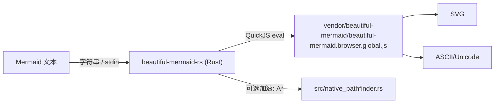

# beautiful-mermaid-rs

用 **Rust** 调用并复刻 TypeScript 版 `beautiful-mermaid` 的渲染行为。
输入 Mermaid 文本。
输出 SVG 或 ASCII/Unicode（终端友好）。

- Mermaid → **SVG**（美观、可主题化、无 DOM 依赖）
- Mermaid → **ASCII/Unicode**（适合终端/CLI/日志）
- 支持图表类型：Flowchart/State、Sequence、Class、ER

## TL;DR（最快上手）

- SVG（写到文件）：

```bash
printf 'graph LR\nA --> B\n' | beautiful-mermaid-rs > diagram.svg
```

- ASCII/Unicode（终端预览）：

```bash
printf 'graph LR\nA --> B\n' | beautiful-mermaid-rs --ascii
```

- 纯 ASCII（兼容性最好）：

```bash
printf 'graph LR\nA --> B\n' | beautiful-mermaid-rs --ascii --use-ascii
```

更完整的 CLI 说明见：`docs/code-agent-cli.md`。

## 为什么有这个项目

我做这个仓库的目标很直接。
是把 `beautiful-mermaid` 的能力交付给 Rust 生态。

你会在下面这些场景里很舒服：

- 你在写 Rust CLI/TUI。
  你希望在终端里把 Mermaid 渲染成 ASCII/Unicode。
- 你在写 Rust 服务或离线工具。
  你希望把 Mermaid 渲染成 SVG。
  然后存档、发邮件、生成报告。
- 你不想在运行时依赖 Node/Deno。
  但你仍然希望"行为与上游一致"。

## 架构概览

当前版本的核心思路是：
先把"行为一致"做成一个稳定基线。
再谈"逐步 Rust 化"。



## 当前实现策略（很重要）

为了尽快达成"输出一致的完整复刻"，本项目目前采用：

- **内嵌 QuickJS（rquickjs）**
- 执行已打包的 **browser IIFE bundle**
- Rust 侧主要做：
  - 参数/选项转换
  - 错误收口（统一成 Rust error）
  - 对外 API（lib）与 CLI 体验

JS bundle 位于：`vendor/beautiful-mermaid/beautiful-mermaid.browser.global.js`。
许可证：MIT（见 `LICENSE`）。

## 原 TS 版 beautiful-mermaid 暴露过的问题（本仓库如何处理）

我把"问题 → 根因 → 修复 → 验证"写在这里。
这样你读完 README 就能判断：
这个仓库解决的到底是什么。

### 1) Flowchart/State 的 Unicode 节点 ID（中文 ID）会导致 `-Infinity` 或空白

- 现象：
  - Mermaid 里用中文当节点 ID，例如 `开始 --> 结束`。
  - 渲染结果会出现 `-Infinity`，或者整张图是空的。
- 根因（摘自本仓库的工作记录）：

  > 根因在上游 TS 版 `beautiful-mermaid`：Flowchart/State parser 用 `\\w`/`[\\w-]` 匹配 ID，中文被解析丢失，最终进入 dagre 空图布局导致 `-Infinity`

- 修复方式（本仓库已包含在 vendor bundle 中）：
  - 把 ID 匹配从 "ASCII 的 `\\w`" 改为 "Unicode 属性类（例如 `\\p{L}\\p{N}`）"。
  - 并启用 `u` flag，确保 Unicode 属性类按预期工作。
- 验证（本仓库已有回归测试）：
  - `tests/unicode_id_smoke.rs` 会断言 SVG 不包含 `-Infinity`，并且包含中文 label。

### 2) ASCII/Unicode 输出遇到宽字符（中文/emoji）会把边框"顶出去"

- 现象：
  - 你在终端里看 ASCII/Unicode 图。
  - 中文节点会把右侧边框撑歪，出现"框不齐"的错觉。
- 根因（摘自本仓库的工作记录）：

  > 上游 TS 版已修复：中文/emoji 等宽字符在 ASCII/Unicode 渲染里不再把边框"顶出去"

- 修复方式（本仓库已包含在 vendor bundle 中）：
  - 引入（简化版）`wcwidth` 模型。
  - 计算布局时用"终端显示宽度"，而不是 `string.length`。
- 验证（本仓库已有回归测试）：
  - `tests/unicode_id_smoke.rs` 会断言"每一行的终端显示宽度一致"。

### 3) QuickJS（无 JIT）下，ASCII/Unicode 的 A* 路由会变成性能瓶颈

这点需要说清楚。
它不是 TS 版在 V8 里慢。
而是"把同一份 JS 逻辑放到 QuickJS 解释执行"会慢。

- 现象：
  - 少数包含自环/循环边的用例，会把 `cargo test` 或 CLI 渲染拖得很慢。
- 根因（摘自本仓库的工作记录）：

  > 在 QuickJS（无 JIT）里跑 A* 的 heap pop + 4 邻居扩展属于典型热循环，遇到复杂用例会明显变慢

- 处理方式（本仓库已实现）：
  - 用 Rust 实现 A*（含 strict 约束版本）。
  - 通过 `rquickjs` 注入：
    - `globalThis.__bm_getPath(...)`
    - `globalThis.__bm_getPathStrict(...)`
  - vendor bundle 会在运行时检测这两个函数。
    存在就走 Rust native。
    否则回退纯 JS。

## 本仓库做了哪些"可见的改动"

如果你想快速对齐"这个仓库比原版多了什么"，看这一节就够了。

- Rust 公共 API：
  - `render_mermaid(text, options) -> Result<String>`（SVG）
  - `render_mermaid_ascii(text, options) -> Result<String>`（ASCII/Unicode）
- Rust CLI：
  - 只从 stdin 读 Mermaid（不接受"文件路径参数"）。
  - 默认输出 SVG。
  - `--ascii` 输出 ASCII/Unicode。
  - `--use-ascii` 强制纯 ASCII（必须与 `--ascii` 一起用）。
  - 退出码约定：`0` 成功 / `1` 渲染失败 / `2` 用法或参数错误。
  - pipe 下游提前关闭（BrokenPipe）按 Unix 习惯视为成功退出。
- 工程化与可维护性：
  - `scripts/sync-vendor-bundle.sh`：一键从 TS 仓库构建并同步 bundle。
  - `make sync-vendor` / `make sync-vendor-verify`：同步 bundle（可选带测试验证）。
  - `make install`：安装前强制先同步 + `cargo test`，避免"装出去的是旧逻辑"。
  - golden tests：`tests/testdata/{ascii,unicode}`。
  - `UPDATE_GOLDEN=1` 模式自动更新 golden（默认关闭，见 `.envrc`）。

快速自检（建议每次同步 bundle 后跑一次）：

```bash
cargo test
```

## 用法（库）

### SVG

```rust
use beautiful_mermaid_rs::{render_mermaid, RenderOptions};

fn main() -> Result<(), Box<dyn std::error::Error>> {
    let diagram = "graph TD\nA --> B\n";
    let svg = render_mermaid(diagram, &RenderOptions::default())?;
    println!("{svg}");
    Ok(())
}
```

### ASCII / Unicode

```rust
use beautiful_mermaid_rs::{render_mermaid_ascii, AsciiRenderOptions};

fn main() -> Result<(), Box<dyn std::error::Error>> {
    let diagram = "graph LR\nA --> B\n";
    let ascii = render_mermaid_ascii(
        diagram,
        &AsciiRenderOptions {
            // true = 纯 ASCII（+ - | >），false = Unicode（┌ ─ │ ►）
            use_ascii: Some(false),
            ..Default::default()
        },
    )?;

    println!("{ascii}");
    Ok(())
}
```

## 在其他 Rust 项目中集成

> 说明：目前本仓库还没发布到 crates.io。
> 因此常见接入方式是 `path` 依赖或 `git` 依赖。

### 1) 添加依赖

#### 方式A：本地 `path`（本机开发最方便）

在你的项目 `Cargo.toml`：

```toml
[dependencies]
beautiful-mermaid-rs = { path = "/Users/cuiluming/local_doc/l_dev/my/rust/beautiful-mermaid-rs" }
```

#### 方式B：`git`（适合团队/CI）

在你的项目 `Cargo.toml`：

```toml
[dependencies]
beautiful-mermaid-rs = { git = "ssh://git@your-host/your-org/beautiful-mermaid-rs.git", rev = "<commit>" }
```

建议你在 CI 场景用 `rev` 固定到某个提交。
这样构建更可复现，也更容易排查问题。

### 2) 在代码里调用

注意：crate 名是 `beautiful-mermaid-rs`，但在 Rust `use` 时要写成下划线形式：`beautiful_mermaid_rs`。

```rust
use beautiful_mermaid_rs::{render_mermaid, render_mermaid_ascii, AsciiRenderOptions, RenderOptions};

fn main() -> Result<(), Box<dyn std::error::Error>> {
    let diagram = "graph LR\nA --> B\n";

    // SVG（内部会同步等待 JS Promise 完成）
    let svg = render_mermaid(diagram, &RenderOptions::default())?;
    println!("{svg}");

    // Unicode ASCII-art（更适合终端）
    let ascii = render_mermaid_ascii(
        diagram,
        &AsciiRenderOptions {
            use_ascii: Some(false),
            ..Default::default()
        },
    )?;
    println!("{ascii}");

    Ok(())
}
```

### 3) 使用内置主题（THEMES）

本仓库提供了主题数据：`beautiful_mermaid_rs::theme::THEMES`。
渲染函数的入参是 `RenderOptions`。
你可以把 `DiagramColors` 映射成 `RenderOptions` 来用：

```rust
use beautiful_mermaid_rs::theme;
use beautiful_mermaid_rs::{render_mermaid, RenderOptions};

fn main() -> Result<(), Box<dyn std::error::Error>> {
    let diagram = "graph LR\nA --> B\n";
    let colors = theme::THEMES.get("tokyo-night").expect("theme not found");

    let options = RenderOptions {
        bg: Some(colors.bg.clone()),
        fg: Some(colors.fg.clone()),
        line: colors.line.clone(),
        accent: colors.accent.clone(),
        muted: colors.muted.clone(),
        surface: colors.surface.clone(),
        border: colors.border.clone(),
        ..Default::default()
    };

    let svg = render_mermaid(diagram, &options)?;
    println!("{svg}");
    Ok(())
}
```

### 4) 在 Tokio / async 项目里使用（建议 spawn_blocking）

当前 API 是同步阻塞的。
如果你的业务是 async（Tokio），建议用 `spawn_blocking`：

```rust
use beautiful_mermaid_rs::{render_mermaid, RenderOptions};

async fn render_svg_async(diagram: String) -> Result<String, beautiful_mermaid_rs::BeautifulMermaidError> {
    tokio::task::spawn_blocking(move || render_mermaid(&diagram, &RenderOptions::default()))
        .await
        .expect("spawn_blocking join failed")
}
```

### 5) 集成注意事项（建议先读）

- 首次调用会更慢一点：每个线程第一次使用时会初始化 QuickJS 并 eval JS bundle。
- 多线程并发没问题：本 crate 使用 thread-local 方式做到"每线程一个 JS 引擎实例"，不会跨线程共享 Context。
- 构建环境：`rquickjs-sys` 会编译 QuickJS 的 C 代码，需要系统有可用的 C 编译工具链。
- SVG 字体：TS 版输出里带了 Google Fonts 的 `@import`（默认 `Inter`）。
  - 离线环境下字体可能加载不到，但 SVG 仍可正常显示。

## 用法（CLI）

从 stdin 读取 Mermaid 文本。
默认输出 SVG。

> 给 code agent 的更完整命令行说明见：`docs/code-agent-cli.md`。
> 如果你已安装为系统 PATH 命令，则直接用 `beautiful-mermaid-rs`；
> 否则在仓库内用 `cargo run --quiet -- ...` 也可以。

- 输出 SVG：

```bash
printf 'graph LR\nA --> B\n' | beautiful-mermaid-rs
```

- 输出 Unicode 线条字符（默认更好看）：

```bash
printf 'graph LR\nA --> B\n' | beautiful-mermaid-rs --ascii
```

- 输出纯 ASCII 字符集（兼容性最好）：

```bash
printf 'graph LR\nA --> B\n' | beautiful-mermaid-rs --ascii --use-ascii
```

## 同步上游 bundle（开发者）

如果你修改了 TypeScript 版 `beautiful-mermaid`（parser/layout/renderer 等）。
Rust 侧需要重新同步 bundle。
否则运行时仍会使用旧逻辑。

在本仓库执行：

```bash
make sync-vendor-verify
```

如果你的 TS 仓库不在默认路径，可以覆盖：

```bash
make TS_REPO_DIR=/path/to/beautiful-mermaid sync-vendor-verify
```

## 测试与 golden

常规运行：

```bash
cargo test
```

测试数据来自 TS 版的 golden files：`tests/testdata/{ascii,unicode}`。

如果你刚同步了 vendor bundle，并且确实是"上游渲染输出发生变化"。
你可以用 `UPDATE_GOLDEN=1` 自动更新 golden：

```bash
UPDATE_GOLDEN=1 cargo test
```

本仓库也提供了 `.envrc`（direnv）。
默认是关闭 `UPDATE_GOLDEN` 的。
这样可以避免你日常 `cargo test` 误写文件。
