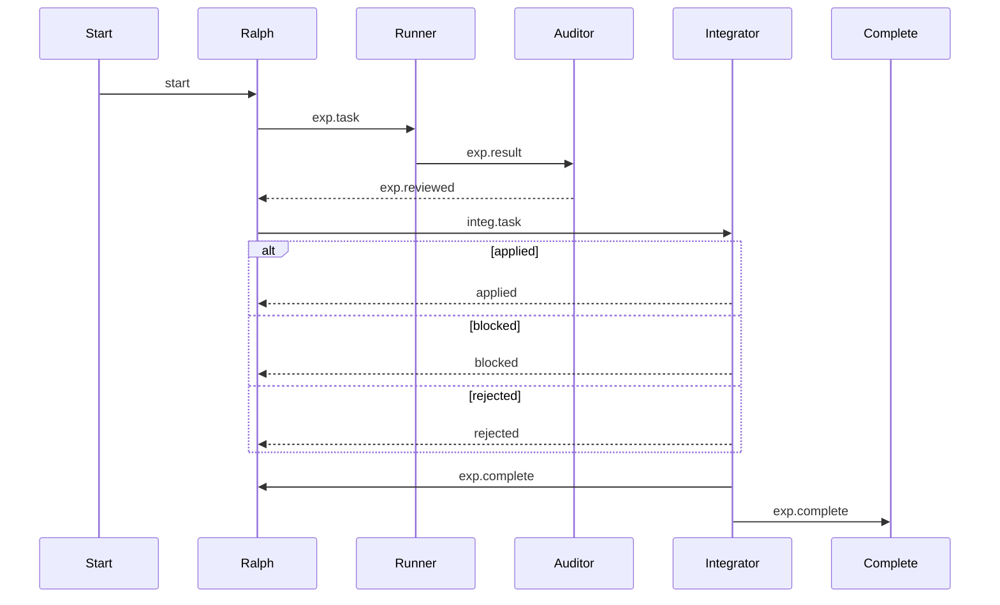

# 终端可读的 Mermaid 写法(经验总结)

这份文档解决一个很常见的问题:
当你的 Mermaid flowchart 存在大量“多入边汇聚到同一个节点”(尤其是协调者/调度者节点)时,
即使渲染器没有 Bug,
在终端 ASCII/Unicode 输出里也很容易变成“线团”,导致人类读不懂逻辑关系。

结论很直接:
这种“多消息往返 + 分支结果回到协调者”的逻辑,更适合用 `sequenceDiagram` 表达。

## 为什么 flowchart 会变“线团”

在 flowchart 里,多条边汇聚到同一个节点时:

- 终端输出必须用 `┬/┴/├/┤/┼` 表示汇聚与分叉,视觉上很容易产生“误连线”的错觉。
- 为了避让 box,带 label 的边经常被迫走外圈,形成“大矩形框”,进一步拉低可读性。

这不是你画得不好,而是终端栅格渲染的物理限制。

## 推荐方案: 改写为 sequenceDiagram

下面用一个典型工作流举例:

### 参与者映射(写在 Mermaid 外,不占图宽度)

- `Start`: `task.start`
- `Ralph`: `ralph#1 (coordinator)`(协调者)
- `Runner`: 实验执行器
- `Auditor`: 结果审计员
- `Integrator`: 集成验收员
- `Complete`: `complete`

### Mermaid(推荐模板)



### 终端渲染效果(Unicode)

> 生成方式:
>
> - `cat diagram.mmd | beautiful-mermaid-rs --ascii`

```text
 ┌───────┐   ┌───────┐    ┌────────┐      ┌─────────┐  ┌────────────┐     ┌──────────┐
 │ Start │   │ Ralph │    │ Runner │      │ Auditor │  │ Integrator │     │ Complete │
 └───┬───┘   └───┬───┘    └────┬───┘      └────┬────┘  └──────┬─────┘     └─────┬────┘
     │           │             │               │              │                 │
     │   start   │             │               │              │                 │
     │───────────▶             │               │              │                 │
     │           │             │               │              │                 │
     │           │  exp.task   │               │              │                 │
     │           │─────────────▶               │              │                 │
     │           │             │               │              │                 │
     │           │             │  exp.result   │              │                 │
     │           │             │───────────────▶              │                 │
     │           │             │               │              │                 │
     │           │        exp.reviewed         │              │                 │
     │           ◀╌╌╌╌╌╌╌╌╌╌╌╌╌╌╌╌╌╌╌╌╌╌╌╌╌╌╌╌╌│              │                 │
     │           │             │               │              │                 │
     │           │             │  integ.task   │              │                 │
     │           │────────────────────────────────────────────▶                 │
     │           │             │               │              │                 │
     │       ┌alt [applied]───────────────────────────────────────┐             │
     │       │   │             │               │              │   │             │
     │       │   │             │    applied    │              │   │             │
     │       │   ◀╌╌╌╌╌╌╌╌╌╌╌╌╌╌╌╌╌╌╌╌╌╌╌╌╌╌╌╌╌╌╌╌╌╌╌╌╌╌╌╌╌╌╌╌│   │             │
     │       │   │             │               │              │   │             │
     │       ├[blocked]╌╌╌╌╌╌╌╌╌╌╌╌╌╌╌╌╌╌╌╌╌╌╌╌╌╌╌╌╌╌╌╌╌╌╌╌╌╌╌╌╌╌╌┤             │
     │       │   │             │               │              │   │             │
     │       │   │             │    blocked    │              │   │             │
     │       │   ◀╌╌╌╌╌╌╌╌╌╌╌╌╌╌╌╌╌╌╌╌╌╌╌╌╌╌╌╌╌╌╌╌╌╌╌╌╌╌╌╌╌╌╌╌│   │             │
     │       │   │             │               │              │   │             │
     │       ├[rejected]╌╌╌╌╌╌╌╌╌╌╌╌╌╌╌╌╌╌╌╌╌╌╌╌╌╌╌╌╌╌╌╌╌╌╌╌╌╌╌╌╌╌┤             │
     │       │   │             │               │              │   │             │
     │       │   │             │   rejected    │              │   │             │
     │       │   ◀╌╌╌╌╌╌╌╌╌╌╌╌╌╌╌╌╌╌╌╌╌╌╌╌╌╌╌╌╌╌╌╌╌╌╌╌╌╌╌╌╌╌╌╌│   │             │
     │       │   │             │               │              │   │             │
     │       └────────────────────────────────────────────────────┘             │
     │           │             │               │              │                 │
     │           │             │ exp.complete  │              │                 │
     │           ◀────────────────────────────────────────────│                 │
     │           │             │               │              │                 │
     │           │             │               │              │  exp.complete   │
     │           │             │               │              │─────────────────▶
     │           │             │               │              │                 │
 ┌───┴───┐   ┌───┴───┐    ┌────┴───┐      ┌────┴────┐  ┌──────┴─────┐     ┌─────┴────┐
 │ Start │   │ Ralph │    │ Runner │      │ Auditor │  │ Integrator │     │ Complete │
 └───────┘   └───────┘    └────────┘      └─────────┘  └────────────┘     └──────────┘
```

## 额外建议(更进一步提高清晰度)

1. label 越短越好
   - 终端里每多 10 个字符,就更容易被迫绕行或让图变宽。
   - 建议用 `exp.task/exp.result/...` 这种缩写,把全称写到 Mermaid 外的说明文字里。

2. 如果流程很长,拆成 2-3 张 sequenceDiagram
   - 每张只讲一个阶段,终端阅读体验会显著提升。

